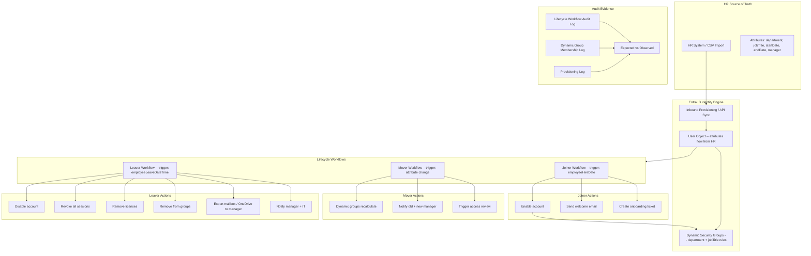

# Zero-Touch JML Lifecycle Pack

> Automated Joiner / Mover / Leaver lifecycle using Entra ID Lifecycle Workflows and dynamic groups

---

## Start Here

| You Are | Read This First |
|---------|----------------|
| **Hiring Manager** | This README (architecture + lifecycle table) then [`expected-vs-observed.md`](docs/expected-vs-observed.md) — proves you can automate the entire identity lifecycle, not just talk about it |
| **Consulting Client** | [`expected-vs-observed.md`](docs/expected-vs-observed.md) — if your org still manually provisions and deprovisions users, the gap is your engagement |
| **Auditor / GRC** | [`expected-vs-observed.md`](docs/expected-vs-observed.md) then [`control-mapping.md`](docs/control-mapping.md) — NIST AC-2, PS-4, PE-2 alignment |
| **Engineer** | [`/code/`](code/) for lifecycle workflow JSON + dynamic group rules then [`jml-operations-runbook.md`](docs/jml-operations-runbook.md) |

---

## Overview

This pack delivers **end-to-end identity lifecycle automation** — from the moment HR creates a new hire record to the moment a terminated employee loses all access. Zero manual provisioning. Zero orphaned accounts. Full audit trail.

**The three lifecycle events:**

| Event | Trigger | What Happens | SLA |
|-------|---------|-------------|-----|
| **Joiner** | Employee start date reached | Account enabled, dynamic groups assign licenses + apps + access, welcome email sent | Day 0 — access ready at 8 AM on start date |
| **Mover** | Department or job title change in HR | Dynamic groups recalculate, old access removed, new access granted, manager notified | Under 30 minutes from attribute change |
| **Leaver** | Employee termination date reached | Account disabled, sessions revoked, licenses removed, manager notified, data exported | Under 1 hour from termination trigger |

**Business Value:** Manual provisioning is the number one source of access drift, orphaned accounts, and audit findings. This pack eliminates all three. Every access decision is attribute-driven, every change is logged, every audit question has an answer.

**Operational Context:** Built from experience governing identity programs for 3,500+ personnel with zero orphaned accounts across 2,200+ credential lifecycles — where missed deprovisioning meant real security risk in regulated DOJ and DOD environments.

---

## Architecture

---

## Dynamic Group Strategy

All access is driven by attributes, not manual assignment. When HR changes a department or job title, the user automatically moves between groups — no tickets, no waiting.

| Group Name | Rule | Purpose |
|------------|------|---------|
| grp-dept-engineering | user.department -eq "Engineering" | Department-scoped access |
| grp-dept-finance | user.department -eq "Finance" | Department-scoped access |
| grp-dept-hr | user.department -eq "Human Resources" | Department-scoped access |
| grp-jobtitle-manager | user.jobTitle -contains "Manager" | Manager-level access |
| grp-license-e5 | user.department -in ["Engineering", "Finance", "HR"] | M365 E5 license assignment |
| grp-license-f3 | user.department -eq "Operations" | M365 F3 license (frontline) |
| grp-app-salesforce | user.department -eq "Sales" | Salesforce SSO access |
| grp-app-jira | user.department -eq "Engineering" | Jira SSO access |
| grp-all-employees | user.accountEnabled -eq true -and user.userType -eq "Member" | All active employees |

---

## Lifecycle Workflow Summary

| Workflow | Trigger | Category | Tasks |
|----------|---------|----------|-------|
| JML-Joiner-Onboard | employeeHireDate = today | Joiner | Enable account, generate TAP, send welcome email, create onboarding ticket |
| JML-Mover-DeptChange | department attribute change | Mover | Trigger access review for old access, notify managers |
| JML-Leaver-Offboard | employeeLeaveDateTime = today | Leaver | Disable account, revoke sessions, remove licenses, remove group memberships, notify manager + IT, export data |
| JML-Leaver-PreNotify | employeeLeaveDateTime - 7 days | Leaver | Notify manager of upcoming departure, trigger knowledge transfer |

---

## Compliance Mapping

| Framework | Control ID | Control Name | Implementation |
|-----------|-----------|--------------|----------------|
| NIST 800-53 | AC-2 | Account Management | Full lifecycle automation: create, modify, disable, remove |
| NIST 800-53 | AC-2(2) | Automated Temporary/Emergency Accounts | Auto-disable on termination date |
| NIST 800-53 | AC-2(3) | Disable Accounts | Leaver workflow disables within 1 hour of trigger |
| NIST 800-53 | AC-2(4) | Automated Audit Actions | All lifecycle events logged to Log Analytics |
| NIST 800-53 | PS-4 | Personnel Termination | Leaver workflow: disable, revoke, remove, notify |
| NIST 800-53 | PS-5 | Personnel Transfer | Mover workflow: regroup, review, notify |
| CIS Azure v2.0 | 1.1.2 | Ensure unused accounts are disabled | Leaver auto-disables; no orphaned accounts |
| CMMC L2 | AC.L2-3.1.1 | Authorized Access Control | Access granted only by HR-driven attribute match |
| CMMC L2 | PS.L2-3.9.2 | Personnel Actions | Automated termination processing |

> Full mapping: [`docs/control-mapping.md`](docs/control-mapping.md)

---

## What's Included

### `code/` — Deployable Artifacts

| File | Description |
|------|-------------|
| `lifecycle-wf-joiner.json` | Entra Lifecycle Workflow: Joiner onboarding |
| `lifecycle-wf-leaver.json` | Entra Lifecycle Workflow: Leaver offboarding |
| `lifecycle-wf-leaver-prenotify.json` | Entra Lifecycle Workflow: 7-day pre-departure notification |
| `dynamic-group-rules.json` | All dynamic security group membership rules |
| `jml-audit-query.kql` | KQL: lifecycle event audit trail |
| `deploy-jml-lifecycle.ps1` | PowerShell: deploy workflows + dynamic groups |

### `docs/` — SOPs, Runbooks, Evidence

| File | Description |
|------|-------------|
| [`expected-vs-observed.md`](docs/expected-vs-observed.md) | The Law of Evidence — 10 controls |
| [`jml-operations-runbook.md`](docs/jml-operations-runbook.md) | Full JML operations SOP |
| [`control-mapping.md`](docs/control-mapping.md) | NIST / CIS / CMMC alignment |

### `screenshots/` — Portal Evidence

| # | What It Shows |
|---|--------------|
| 01 | Lifecycle workflows list (Joiner, Mover, Leaver active) |
| 02 | Joiner workflow tasks and execution history |
| 03 | Leaver workflow tasks and execution history |
| 04 | Dynamic group membership rules |
| 05 | Dynamic group processing log (member added/removed) |
| 06 | User provisioning log (attribute flow from HR) |

---

## Deployment Guide

| Step | Action | Duration |
|------|--------|----------|
| 1 | Configure HR inbound provisioning (API or CSV) | 2 hours |
| 2 | Create dynamic security groups with department/jobTitle rules | 1 hour |
| 3 | Verify dynamic group membership populates correctly | 30 min + wait |
| 4 | Create Joiner lifecycle workflow | 30 min |
| 5 | Create Leaver lifecycle workflow | 30 min |
| 6 | Create Leaver pre-notify workflow (7-day) | 15 min |
| 7 | Test Joiner: create test user with future start date, verify onboarding | 1 hour |
| 8 | Test Mover: change test user department, verify regroup | 30 min |
| 9 | Test Leaver: set termination date, verify offboarding | 1 hour |
| 10 | Capture screenshots and complete E-v-O | 1.5 hours |

> Prerequisites: Entra ID P2 (Governance license for Lifecycle Workflows), HR source configured, dynamic groups require Entra ID P1+

---

## Related Packs

| Pack | Relationship |
|------|-------------|
| [Conditional Access Baseline](../03-conditional-access-baseline/) | Dynamic groups used in CA policy assignments |
| [PIM + Break-Glass SOP](../04-pim-breakglass-sop/) | Admin accounts provisioned through separate process (not JML) |
| [Access Reviews Automation](../02-access-reviews-automation/) | Mover triggers access review; Leaver triggers emergency review |
| [Vendor/Guest vIAM](../06-vendor-guest-viam/) | Guest lifecycle separate from employee JML |
| [SailPoint IIQ Config](../07-sailpoint-iiq-config/) | SailPoint handles JML for complex enterprise; this pack is Entra-native |

---

## Changelog

| Version | Date | Change |
|---------|------|--------|
| 1.0.0 | 2026-02-10 | Initial release |

---

**© 2026 Stella Maris Governance LLC** — Evaluation and demonstration use permitted. Commercial use requires engagement.

*The work speaks for itself. Stella Maris — the one light that does not drift.*

