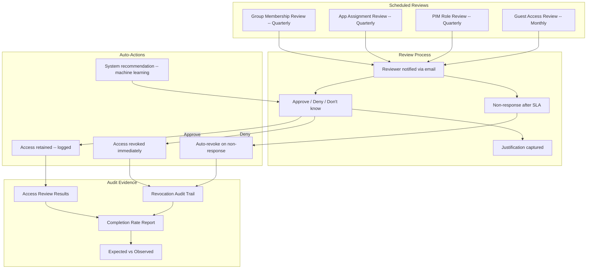

# Access Reviews Automation Pack

> Automated Entra ID Access Reviews for group memberships, app assignments, PIM roles, and guest access

---

## Start Here

| You Are | Read This First |
|---------|----------------|
| **Hiring Manager** | This README then [`expected-vs-observed.md`](docs/expected-vs-observed.md) — proves you can run continuous access certification, not just annual rubber-stamp reviews |
| **Consulting Client** | [`expected-vs-observed.md`](docs/expected-vs-observed.md) — if your org does annual spreadsheet reviews or none at all, the gap is your engagement |
| **Auditor / GRC** | [`expected-vs-observed.md`](docs/expected-vs-observed.md) then [`control-mapping.md`](docs/control-mapping.md) — NIST AC-2(7), AC-6(7) alignment with auto-revoke evidence |
| **Engineer** | [`/code/`](code/) for access review definitions then [`access-reviews-runbook.md`](docs/access-reviews-runbook.md) |

---

## The Problem

Access reviews are the audit control that everyone hates and nobody does well.

Here's what happens in most organizations: once a quarter, a manager receives an email with a spreadsheet of 47 people and their access. The manager glances at it, recognizes most of the names, clicks "approve all," and goes back to their actual job. The review is "complete." The audit box is checked. Nothing was actually reviewed.

This is rubber-stamping, and it is worse than no review at all. A review that never happens is an honest gap. A review that happens but changes nothing is a false assurance — the organization believes access is validated when it isn't.

The real cost shows up six months later when an auditor asks: "Why does a contractor who left in March still have access to your financial reporting application?" The answer is always the same: "The manager approved it in the quarterly review." Nobody looked. Everybody approved. The process existed. The governance didn't.

Automated access reviews solve this by making non-response a revocation event, not an implicit approval. If a reviewer doesn't respond, access is removed. That single policy change transforms reviews from theater into governance.

> **Watchstander Note:** The most dangerous word in access governance is "approved." It implies someone evaluated and decided. In practice, it usually means someone clicked a button. This pack makes the distinction visible — and makes inaction have consequences.

---

## Overview

This pack delivers **continuous, automated access certification** across four access domains: group memberships, application assignments, PIM eligible roles, and guest/external users. Reviews are scheduled, delegated to appropriate reviewers, and auto-revoke access when reviewers don't respond.

**The problem this solves:** Most organizations either do no access reviews, do annual spreadsheet reviews (rubber-stamp), or rely on manual processes that miss access drift. This pack automates the entire cycle — schedule, notify, collect decisions, revoke, report.

**Four review domains, one governance engine:**

| Review | Scope | Reviewer | Frequency | Auto-Revoke |
|--------|-------|----------|-----------|-------------|
| **Group membership** | Department and role-based security groups | Group owner / manager | Quarterly | Yes — 14-day non-response |
| **Application access** | Enterprise app assignments (Salesforce, Jira, etc.) | App owner | Quarterly | Yes — 14-day non-response |
| **PIM eligible roles** | All PIM-managed admin role assignments | Security Administrator | Quarterly | Yes — 14-day non-response |
| **Guest access** | All guest/external users | Inviting user / sponsor | Monthly | Yes — 7-day non-response |

**Business Value:** Access reviews are the most common audit finding in identity programs. Organizations that can demonstrate automated, continuous review with auto-revoke evidence close audit gaps immediately and reduce risk exposure from stale access.

**Operational Context:** Built from experience running credential validation programs across 3,500+ personnel where every access decision was documented, reviewed on cadence, and revoked when no longer justified — because in regulated environments, unreviewed access is unauthorized access.

---

## Architecture

---

## Access Review Definitions

| Review Name | Scope | Reviewer | Frequency | Duration | Auto-Revoke | Recommendations |
|-------------|-------|----------|-----------|----------|-------------|-----------------|
| AR-GRP-Quarterly | All grp-dept-* and grp-app-* groups | Group owners | Every 90 days | 14 days | Yes | Enabled (sign-in activity) |
| AR-APP-Quarterly | Salesforce, Jira, ServiceNow assignments | App owners | Every 90 days | 14 days | Yes | Enabled |
| AR-PIM-Quarterly | All PIM eligible role assignments | Security Administrator | Every 90 days | 14 days | Yes | Enabled |
| AR-GUEST-Monthly | All guest/external users | Sponsor / inviter | Every 30 days | 7 days | Yes | Enabled (sign-in activity) |

### Auto-Revoke Logic

When a reviewer does not respond within the review duration:
- **Groups:** User removed from group (loses group-based access)
- **Apps:** User assignment removed (loses SSO access)
- **PIM:** Eligible assignment removed (loses ability to activate)
- **Guests:** Guest account disabled, access blocked

This is the most critical design decision: **non-response = deny.** This eliminates rubber-stamp risk and ensures stale access cannot persist through reviewer inaction.

---

## Compliance Mapping

| Framework | Control ID | Control Name | Implementation |
|-----------|-----------|--------------|----------------|
| NIST 800-53 | AC-2(7) | Privileged User Accounts Review | PIM quarterly review for all eligible roles |
| NIST 800-53 | AC-6(7) | Review of User Privileges | Quarterly group + app reviews |
| NIST 800-53 | AC-2(3) | Disable Accounts | Auto-revoke on non-response disables stale access |
| NIST 800-53 | AU-6 | Audit Record Review | Review completion reports with decision + justification |
| CIS Azure v2.0 | 1.1.4 | Ensure PIM access reviews | PIM eligible assignments reviewed quarterly |
| CMMC L2 | AC.L2-3.1.7 | Privileged Functions | PIM roles validated quarterly via access review |
| CMMC L2 | AC.L2-3.1.1 | Authorized Access Control | All access reviewed and certified by owner |
| SOX ITGC | Periodic access review | All access certified by business owner | Quarterly with auto-revoke |

> Full mapping: [`docs/control-mapping.md`](docs/control-mapping.md)

---

## What's Included

### `code/` — Deployable Artifacts

| File | Description |
|------|-------------|
| `access-review-group.json` | Access review definition: group memberships |
| `access-review-app.json` | Access review definition: app assignments |
| `access-review-pim.json` | Access review definition: PIM eligible roles |
| `access-review-guest.json` | Access review definition: guest/external users |
| `review-completion-query.kql` | KQL: review completion rates + revocation counts |
| `deploy-access-reviews.ps1` | PowerShell: create all 4 access review schedules |

### `docs/` — SOPs, Runbooks, Evidence

| File | Description |
|------|-------------|
| [`expected-vs-observed.md`](docs/expected-vs-observed.md) | The Law of Evidence — 10 controls |
| [`access-reviews-runbook.md`](docs/access-reviews-runbook.md) | Full operations SOP |
| [`control-mapping.md`](docs/control-mapping.md) | NIST / CIS / CMMC / SOX alignment |

### `screenshots/` — Evidence

This pack uses **deterministic engine outputs** as primary evidence rather than portal screenshots.

| Evidence Type | Format | Purpose |
|--------------|--------|---------|
| Engine output (`.txt`) | Script terminal output | Primary — proves logic and methodology |
| Report output (`.md`) | Formatted engine report | Primary — proves analysis and findings |
| Portal screenshot (`.png`) | Azure portal capture | Secondary — added when running against live environment |

> See `EVIDENCE-README.md` in the screenshots directory for the full evidence approach.

---

## Deployment Guide

| Step | Action | Duration |
|------|--------|----------|
| 1 | Ensure group owners are assigned on all grp-dept and grp-app groups | 1 hour |
| 2 | Ensure app owners are assigned on enterprise app registrations | 30 min |
| 3 | Create group membership access review (AR-GRP-Quarterly) | 20 min |
| 4 | Create app assignment access review (AR-APP-Quarterly) | 20 min |
| 5 | Create PIM role access review (AR-PIM-Quarterly) | 20 min |
| 6 | Create guest access review (AR-GUEST-Monthly) | 20 min |
| 7 | Wait for first review cycle to complete | 14-30 days |
| 8 | Verify auto-revoke fired for any non-responses | 1 hour |
| 9 | Capture screenshots and complete E-v-O | 1.5 hours |

> Prerequisites: Entra ID P2 (Access Reviews require P2), group/app owners assigned, PIM configured (see Pack 04)

---

## Related Packs

| Pack | Relationship |
|------|-------------|
| [Zero-Touch JML Lifecycle](../01-zero-touch-jml-lifecycle/) | Mover events trigger access review for old access |
| [Conditional Access Baseline](../03-conditional-access-baseline/) | CA exception groups included in quarterly review |
| [PIM + Break-Glass SOP](../04-pim-breakglass-sop/) | PIM eligible assignments reviewed quarterly here |
| [SoD Matrix](../05-sod-matrix/) | SoD violations flagged during access review decisions |
| [Vendor/Guest vIAM](../06-vendor-guest-viam/) | Guest review syncs with guest lifecycle policy |

---

## Changelog

| Version | Date | Change |
|---------|------|--------|
| 1.0.0 | 2026-02-10 | Initial release |

---

**© 2026 Stella Maris Governance LLC** — Evaluation and demonstration use permitted. Commercial use requires engagement.

*The work speaks for itself. Stella Maris — the one light that does not drift.*

