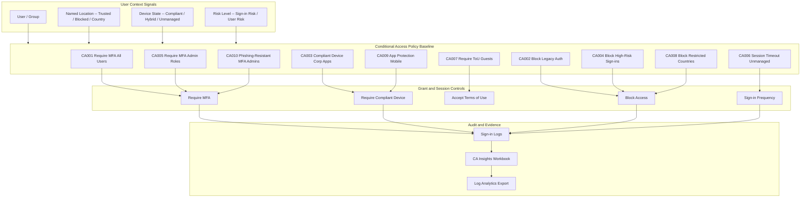

# Conditional Access Baseline Pack

> Production-ready Conditional Access policy set aligned to Microsoft best practices and Zero Trust

[](https://learn.microsoft.com/en-us/credentials/certifications/identity-and-access-administrator/)
[](https://learn.microsoft.com/en-us/credentials/certifications/azure-security-engineer/)
[](https://learn.microsoft.com/en-us/credentials/certifications/security-compliance-and-identity-fundamentals/)
[]()
[]()

---

## Start Here

| You Are | Read This First |
|---------|----------------|
| **Hiring Manager** | This README (architecture + policy table) then [`expected-vs-observed.md`](docs/expected-vs-observed.md) for proof |
| **Consulting Client** | [`expected-vs-observed.md`](docs/expected-vs-observed.md) — the gap between Expected and your Observed is the engagement scope |
| **Auditor / GRC** | [`expected-vs-observed.md`](docs/expected-vs-observed.md) then [`control-mapping.md`](docs/control-mapping.md) for NIST/CIS/CMMC alignment |
| **Engineer** | [`/code/`](code/) for deployable policy JSON then [`conditional-access-runbook.md`](docs/conditional-access-runbook.md) for procedures |

---

## Overview

This pack delivers a **complete 10-policy Conditional Access baseline** for Microsoft Entra ID. It covers MFA enforcement, legacy authentication blocking, device compliance, risk-based controls, session management, guest access governance, and phishing-resistant authentication for administrators.

All policies follow Microsoft's recommended naming convention and are deployable via JSON export/import or PowerShell automation.

**Business Value:** Establishes Zero Trust access controls from day one. Maps directly to NIST 800-53 IA/AC control families, CIS Azure Benchmark 1.1.x, and CMMC Level 2 practices. Provides audit-ready policy documentation with full evidence chain.

**Operational Context:** Informed by real-world credential governance for 2,200+ CAC/PKI credentials with zero-incident accountability across a regulated population of 3,500+ personnel.

---

## Architecture


---

## Policy Baseline (10 Policies)

| ID | Policy Name | Assignment | Grant / Session Control | Status |
|---|---|---|---|---|
| CA001 | Require MFA All Users | All users (excl. break-glass) | Require multifactor authentication | Enabled |
| CA002 | Block Legacy Authentication | All users, legacy client apps | Block access | Enabled |
| CA003 | Require Compliant Device Corp Apps | All users, corporate apps | Require compliant or hybrid-joined device | Enabled |
| CA004 | Block High-Risk Sign-ins | All users, sign-in risk = High | Block access | Enabled |
| CA005 | Require MFA Admin Roles | Global Admin, Security Admin, Exchange Admin, SharePoint Admin | Require MFA | Enabled |
| CA006 | Session Timeout Unmanaged Devices | All users, unmanaged devices | Sign-in frequency: 4 hours, persistent browser: disabled | Enabled |
| CA007 | Require Terms of Use Guests | All guest / external users | Require Terms of Use acceptance | Enabled |
| CA008 | Block Restricted Countries | All users, named location Blocked Countries (RU, CN, KP, IR) | Block access | Enabled |
| CA009 | App Protection Mobile | All users, iOS, Android | Require app protection policy | Enabled |
| CA010 | Phishing-Resistant MFA Admins | Admin roles | Authentication strength: phishing-resistant MFA (FIDO2, WHfB) | Enabled |

### Naming Convention
```
CA{###}-{Target}-{Control}-{Platform}
```

---

## Compliance Mapping

| Framework | Control ID | Control Name | Policies |
|-----------|-----------|--------------|----------|
| NIST 800-53 | IA-2 | Identification and Authentication | CA001, CA005, CA010 |
| NIST 800-53 | IA-2(1) | MFA to Privileged Accounts | CA005, CA010 |
| NIST 800-53 | IA-2(2) | MFA to Non-Privileged Accounts | CA001 |
| NIST 800-53 | IA-5 | Authenticator Management | CA002, CA010 |
| NIST 800-53 | AC-7 | Unsuccessful Logon Attempts | CA004 |
| NIST 800-53 | AC-17 | Remote Access | CA003, CA006 |
| NIST 800-53 | IA-8 | Identification and Auth Non-Org Users | CA007, CA008 |
| CIS Azure v2.0 | 1.1.1 | Ensure MFA is enabled for all users | CA001 |
| CIS Azure v2.0 | 1.1.3 | Ensure MFA is enabled for all privileged users | CA005, CA010 |
| CIS Azure v2.0 | 1.1.6 | Block legacy authentication | CA002 |
| CMMC L2 | IA.L2-3.5.3 | Multifactor Authentication | CA001, CA005, CA010 |
| CMMC L2 | AC.L2-3.1.12 | Remote Access Sessions | CA006 |

> Full control mapping with evidence links: [`docs/control-mapping.md`](docs/control-mapping.md)

---

## What's Included

### `code/` — Deployable Artifacts (12 files)

| File | Description |
|------|-------------|
| `CA001-AllUsers-RequireMFA.json` through `CA010-Admins-PhishingResistantMFA.json` | 10 Conditional Access policy definitions |
| `named-locations.json` | Trusted networks + blocked countries configuration |
| `deploy-conditional-access.ps1` | PowerShell: deploy all policies (Report-Only then Enabled) |

### `docs/` — SOPs, Runbooks, Evidence

| File | Description |
|------|-------------|
| [`expected-vs-observed.md`](docs/expected-vs-observed.md) | The Law of Evidence — 10 controls with expected/observed state, evidence, pass/fail |
| [`conditional-access-runbook.md`](docs/conditional-access-runbook.md) | Full operations runbook |
| [`control-mapping.md`](docs/control-mapping.md) | NIST 800-53 / CIS Azure / CMMC L2 alignment |

### `screenshots/` — Portal Evidence

| # | What It Shows |
|---|--------------|
| 01 | All 10 CA policies with status |
| 02-08 | Policy details, grant controls, named locations, CA Insights, sign-in logs |

---

## Deployment Guide

| Step | Action | Duration |
|------|--------|----------|
| 1 | Configure named locations (trusted networks + blocked countries) | 30 min |
| 2 | Import all 10 policies in **Report-Only** mode via PowerShell | 1 hour |
| 3 | Monitor sign-in logs + CA Insights workbook for impact | 7-14 days |
| 4 | Review impact: identify false positives, document exceptions | 2 hours |
| 5 | Enable policies sequentially: CA001 through CA010 | 1 week |
| 6 | Capture screenshots for evidence portfolio | 1 hour |
| 7 | Complete Expected vs Observed assessment | 1 hour |

> Prerequisites: Entra ID P1/P2, Intune, named locations, break-glass accounts created — see [PIM + Break-Glass SOP Pack](../04-pim-breakglass-sop/)

---

## Related Packs

| Pack | Relationship |
|------|-------------|
| [PIM + Break-Glass SOP](../04-pim-breakglass-sop/) | Break-glass accounts must be excluded from all CA policies |
| [Access Reviews Automation](../02-access-reviews-automation/) | CA exception reviews in quarterly access reviews |
| [Zero-Touch JML Lifecycle](../01-zero-touch-jml-lifecycle/) | Dynamic groups in CA assignments populated by JML workflows |
| [Vendor/Guest vIAM](../06-vendor-guest-viam/) | CA007 integrates with guest lifecycle management |
| [KQL Query Pack](../../cloud-security-packs/03-kql-query-pack/) | KQL-03 monitors CA policy bypass |
| [Sentinel Detection](../../cloud-security-packs/02-sentinel-detection-runbook/) | Detects anomalous CA policy changes |

---

## Changelog

| Version | Date | Change |
|---------|------|--------|
| 1.0.0 | 2026-02-10 | Initial release: 10-policy baseline with E-v-O, runbook, and control mapping |

---

<div align="center">

**© 2026 Stella Maris Governance LLC** — Evaluation and demonstration use permitted. Commercial use requires engagement.

*The work speaks for itself. Stella Maris — the one light that does not drift.*

</div>
