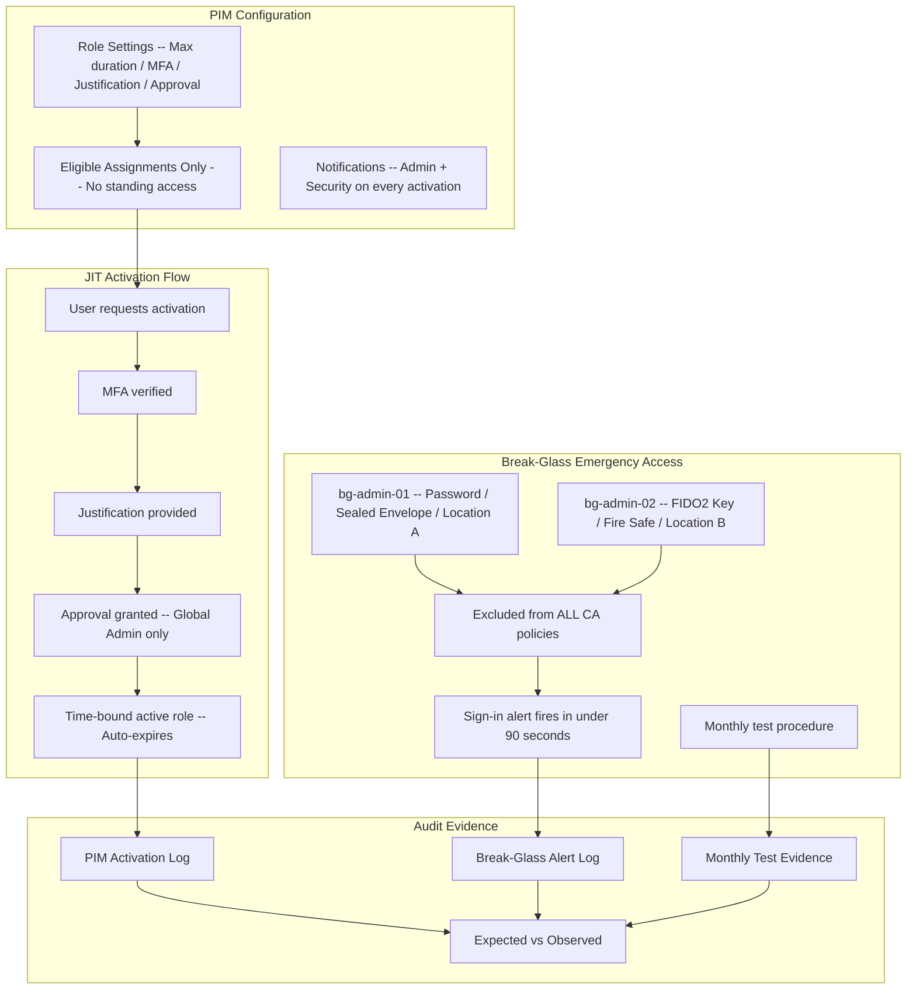

# PIM + Break-Glass SOP Pack

> Privileged Identity Management configuration with tested emergency access procedures

---

> **Governance Notice** — This pack is governed by the [Stella Maris Constitution (CONST-01)](https://github.com/stella-maris-governance/smg-enterprise-hq) and enforces **POL-AC-01 (Access Control) · NIST AC-6, AC-2(2)**. All dispositions are subject to the Two-Person Integrity Protocol.

---

## Start Here

| You Are | Read This First |
|---------|----------------|
| **Hiring Manager** | This README then [`expected-vs-observed.md`](docs/expected-vs-observed.md) — proves you can eliminate standing admin access AND maintain business continuity |
| **Consulting Client** | [`expected-vs-observed.md`](docs/expected-vs-observed.md) — if your admins have permanent Global Admin, the gap is your engagement |
| **Auditor / GRC** | [`expected-vs-observed.md`](docs/expected-vs-observed.md) then [`control-mapping.md`](docs/control-mapping.md) — NIST AC-6, AC-2(7), CP-2 alignment |
| **Engineer** | [`/code/`](code/) for PIM config JSON then [`pim-operations-runbook.md`](docs/pim-operations-runbook.md) + [`breakglass-sop.md`](docs/breakglass-sop.md) |

---

## The Problem

In most organizations, Global Administrators are standing privileges. Someone was made a Global Admin during initial setup, and they've been a Global Admin ever since. They don't need it daily. They might not need it weekly. But they have it constantly — and every minute they hold that privilege is a minute an attacker who compromises their account also holds it.

Standing privilege is the amplifier behind every major breach. The initial compromise is usually unremarkable — a phished credential, a leaked token, a session hijack. What makes it catastrophic is what happens next: the compromised account has standing access to everything. No elevation required. No approval needed. No time limit.

Privileged Identity Management enforces the **Use Least Privilege** principle of Zero Trust Architecture by eliminating standing access — making every elevation just-in-time, time-bounded, and approval-required. You don't have Global Admin. You activate Global Admin for 2 hours, with justification, with approval, with an audit trail. When the 2 hours expire, the privilege disappears. The blast radius shrinks from permanent to measured.

But there's a trap: if PIM governs all admin access and PIM itself breaks — a configuration error, a service outage, an Entra ID incident — nobody can administer the tenant. Break-glass accounts exist for this scenario. They bypass PIM, bypass Conditional Access, and carry permanent Global Admin. They are the most dangerous accounts in your environment, and they must be the most carefully governed.

> **Watchstander Note:** Break-glass accounts are like fire axes behind glass. They exist for emergencies. They must be tested to prove they work. And if the glass is broken without a fire, that event must be investigated immediately. An untested break-glass account is a promise you can't keep. A used break-glass account without documentation is a potential compromise.

---

## Overview

This pack delivers two tightly coupled capabilities:

**1. Privileged Identity Management (PIM)** — Eliminates standing privileged access. All admin roles are eligible only with just-in-time activation requiring MFA, business justification, and approval for critical roles. Maximum activation windows enforced. Every activation logged and auditable.

**2. Break-Glass Emergency Access** — Two emergency accounts with separate authentication methods stored in separate physical locations. Monthly tested. Automated alerting on any sign-in. Documented activation and post-incident procedures.

**Business Value:** Zero Standing Privilege is the highest-maturity identity security control an organization can implement. Combined with tested emergency access, this satisfies the most demanding audit requirements while ensuring the business is never locked out of its own tenant.

**Operational Context:** Built from 20 years of credential lifecycle management in regulated environments — including accountability for 2,200+ CAC/PKI credentials with a zero-incident record across 3,500+ personnel. The break-glass SOP follows the same sealed credential, tested monthly, documented evidence pattern used in military and federal emergency access procedures.

---

## Architecture

---

## PIM Role Settings Matrix

| Role | Assignment Type | Max Activation | MFA | Justification | Approval Required | Approver |
|------|----------------|---------------|-----|---------------|-------------------|----------|
| Global Administrator | Eligible only | 8 hours | Yes | Yes | Yes | Security Administrator |
| Security Administrator | Eligible only | 8 hours | Yes | Yes | No | — |
| Exchange Administrator | Eligible only | 8 hours | Yes | Yes | No | — |
| SharePoint Administrator | Eligible only | 8 hours | Yes | Yes | No | — |
| Intune Administrator | Eligible only | 4 hours | Yes | Yes | No | — |

**Key design decisions:**
- Zero active assignments for all admin roles (except break-glass — permanent by design)
- Approval required only for Global Admin — balances security with operational velocity
- 8-hour maximum prevents overnight forgotten sessions
- MFA + justification on ALL roles — non-negotiable baseline

---

## Break-Glass Account Design

| Property | bg-admin-01 | bg-admin-02 |
|----------|-------------|-------------|
| **Role** | Global Administrator (permanent active) | Global Administrator (permanent active) |
| **Auth method** | Complex password (24+ chars) | FIDO2 security key |
| **Storage** | Sealed envelope, locked cabinet, Location A | FIDO2 key in fire safe, Location B |
| **CA policy status** | Excluded from ALL policies | Excluded from ALL policies |
| **MFA** | None configured (password-only) | FIDO2 only (no fallback) |
| **Monitoring** | KQL alert on ANY sign-in, under 90 seconds | Same |
| **Test cadence** | Monthly (1st of month) | Monthly (1st of month) |
| **License** | No M365 license | No M365 license |

**Why two different auth methods, two different locations:**

| Failure Scenario | Which Account Works |
|------------------|-------------------|
| MFA infrastructure down | bg-admin-01 (password only) |
| Password-based auth compromised | bg-admin-02 (FIDO2 only) |
| Single physical location destroyed | The account at the other location |
| CA misconfiguration locks everyone out | Both (excluded from all policies) |
| PIM service down | Both (permanent active, not PIM-managed) |

---

## Compliance Mapping

| Framework | Control ID | Control Name | Implementation |
|-----------|-----------|--------------|----------------|
| NIST 800-53 | AC-6 | Least Privilege | JIT activation eliminates standing access |
| NIST 800-53 | AC-6(1) | Authorize Access to Security Functions | Approval required for Global Admin |
| NIST 800-53 | AC-2(7) | Privileged User Accounts | JIT with MFA + justification |
| NIST 800-53 | CP-2 | Contingency Plan | Break-glass emergency access |
| NIST 800-53 | CP-4 | Contingency Plan Testing | Monthly break-glass test |
| NIST 800-53 | SI-4 | System Monitoring | Alert on break-glass sign-in under 90 sec |
| CIS Azure v2.0 | 1.1.4 | Ensure PIM is used for admin roles | All admin roles through PIM |
| CIS Azure v2.0 | 1.1.5 | Ensure break-glass accounts configured | 2 accounts, different auth, different locations |
| CMMC L2 | AC.L2-3.1.5 | Least Privilege | JIT with time-bound access |
| CMMC L2 | AC.L2-3.1.6 | Non-Privileged Accounts | Standard accounts daily; PIM for admin |

> Full mapping: [`docs/control-mapping.md`](docs/control-mapping.md)

---

## What's Included

### `code/` — Deployable Artifacts

| File | Description |
|------|-------------|
| `pim-role-settings.json` | PIM config for 5 admin roles |
| `pim-activation-alert.kql` | Alert on every PIM activation |
| `breakglass-monitoring.kql` | Near-real-time alert on break-glass sign-in |
| `breakglass-test-log.md` | Monthly test log template with sample entries |

### `docs/` — SOPs, Runbooks, Evidence

| File | Description |
|------|-------------|
| [`expected-vs-observed.md`](docs/expected-vs-observed.md) | **THE proof table** — 10 controls |
| [`pim-operations-runbook.md`](docs/pim-operations-runbook.md) | Full PIM operations SOP |
| [`breakglass-sop.md`](docs/breakglass-sop.md) | Break-glass SOP: creation, storage, monthly test, emergency activation, post-incident |
| [`control-mapping.md`](docs/control-mapping.md) | NIST / CIS / CMMC alignment |

### `screenshots/` — Evidence

This pack uses **deterministic engine outputs** as primary evidence rather than portal screenshots.

| Evidence Type | Format | Purpose |
|--------------|--------|---------|
| Engine output (`.txt`) | Script terminal output | Primary — proves logic and methodology |
| Report output (`.md`) | Formatted engine report | Primary — proves analysis and findings |
| Portal screenshot (`.png`) | Azure portal capture | Secondary — added when running against live environment |

> See `EVIDENCE-README.md` in the screenshots directory for the full evidence approach.

---

## Deployment Guide

| Step | Action | Duration |
|------|--------|----------|
| 1 | Create break-glass accounts (bg-admin-01, bg-admin-02) | 30 min |
| 2 | Assign permanent Global Admin to both | 10 min |
| 3 | Add to grp-ca-breakglass-exclude | 5 min |
| 4 | Verify exclusion from ALL CA policies | 15 min |
| 5 | Configure PIM role settings for 5 admin roles | 1 hour |
| 6 | Convert all active admin assignments to eligible | 30 min |
| 7 | Deploy PIM activation alert (KQL) | 15 min |
| 8 | Deploy break-glass monitoring alert (KQL) | 15 min |
| 9 | Seal credentials in physical storage | 15 min |
| 10 | Execute first monthly break-glass test | 30 min |

**Critical:** Steps 1-4 MUST complete before Step 6. Converting admins to eligible without working break-glass accounts could lock you out of the tenant.

---

## Related Packs

| Pack | Relationship |
|------|-------------|
| [Conditional Access Baseline](../03-conditional-access-baseline/) | Break-glass excluded from all CA policies |
| [Access Reviews Automation](../02-access-reviews-automation/) | PIM eligible assignments in quarterly reviews |
| [SoD Matrix](../05-sod-matrix/) | PIM roles in SoD conflict detection |
| [KQL Query Pack](../../cloud-security-packs/03-kql-query-pack/) | KQL-04 monitors PIM activations |
| [Sentinel Detection](../../cloud-security-packs/02-sentinel-detection-runbook/) | Detects PIM activation outside business hours |

---

## Changelog

| Version | Date | Change |
|---------|------|--------|
| 1.0.0 | 2026-02-10 | Initial release |

---

**© 2026 Stella Maris Governance LLC** — Evaluation and demonstration use permitted. Commercial use requires engagement.

*"Expected vs Observed" — because proof beats promises.*

