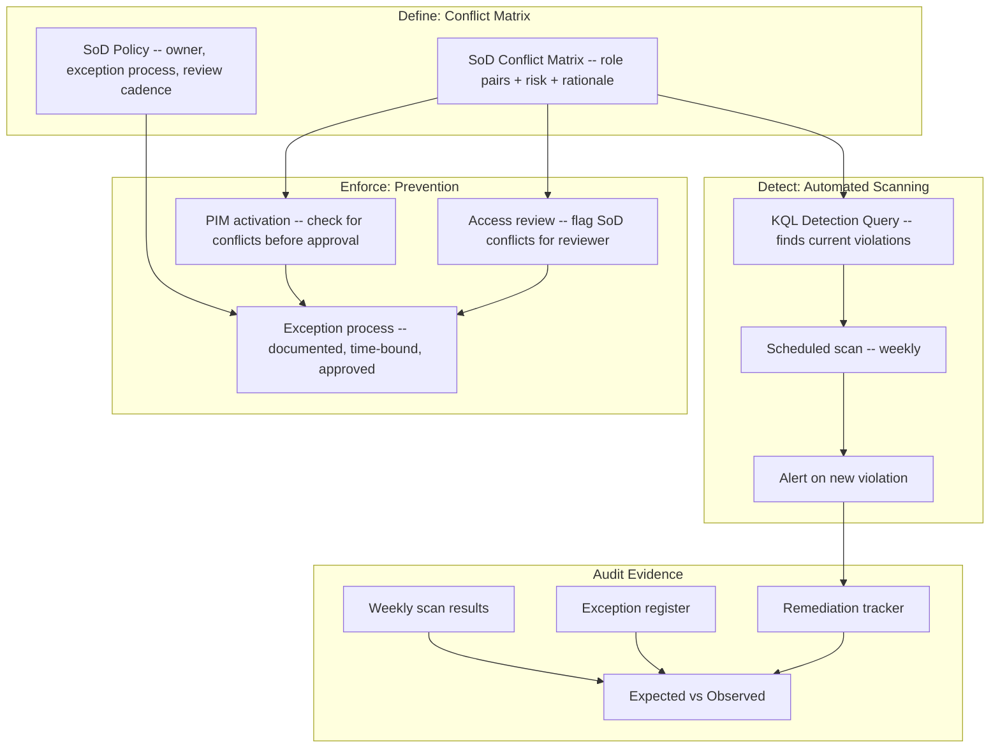

# Separation of Duties Matrix Pack

> Role-conflict detection and enforcement for privileged Entra ID roles and business-critical application access

---

> **Governance Notice** — This pack is governed by the [Stella Maris Constitution (CONST-01)](https://github.com/stella-maris-governance/smg-enterprise-hq) and enforces **POL-AC-01 (Access Control) · NIST AC-5**. All dispositions are subject to the Two-Person Integrity Protocol.

---

## Start Here

| You Are | Read This First |
|---------|----------------|
| **Hiring Manager** | This README (SoD matrix + detection logic) then [`expected-vs-observed.md`](docs/expected-vs-observed.md) — proves you can identify and enforce separation of duties, not just document a policy |
| **Consulting Client** | [`expected-vs-observed.md`](docs/expected-vs-observed.md) — if nobody has mapped your role conflicts, the gap is your engagement |
| **Auditor / GRC** | [`expected-vs-observed.md`](docs/expected-vs-observed.md) then [`control-mapping.md`](docs/control-mapping.md) — NIST AC-5, AC-6(1), SOX segregation alignment |
| **Engineer** | [`/code/`](code/) for conflict matrix JSON + detection KQL then [`sod-operations-runbook.md`](docs/sod-operations-runbook.md) |

---

## The Problem

An IT administrator who can both create user accounts and approve access requests can create a ghost account and grant it access to anything. A finance user who can both initiate payments and approve them can pay themselves. A security admin who can both configure audit logs and delete them can cover their tracks.

These aren't theoretical risks. They're the exact role combinations that fraud examiners look for in every investigation. Separation of Duties exists to ensure that no single person can complete a high-risk action without a second person's involvement. It's the same principle behind dual-key nuclear launch and two-person integrity in classified material handling: trust is not a single point of failure.

In cloud environments, SoD violations are invisible until they're exploited. Entra ID doesn't natively prevent someone from holding User Administrator and Application Administrator simultaneously. Azure RBAC doesn't warn you when someone has both Contributor and Security Admin on the same subscription. These combinations accumulate silently through role assignments, group memberships, and PIM activations that nobody cross-references.

This pack builds the cross-reference. Every privileged role combination is evaluated against a conflict matrix. Every violation is detected, documented, and either remediated or accepted with compensating controls. No silent accumulation. No invisible conflicts.

> **Watchstander Note:** In Navy supply chain operations, two-person integrity wasn't optional — it was policy for handling classified material, crypto keys, and financial transactions. The same principle applies to digital role assignments. If one person can both create the access and approve the access, your governance has a single point of compromise.

---

## Overview

This pack delivers a **defined, detectable, enforceable** Separation of Duties framework for Entra ID directory roles and business application access. SoD violations are the most common finding in SOX audits and one of the highest-risk gaps in identity governance.

**The problem this solves:** Organizations assign roles without checking for conflicts. A user who can both create vendors AND approve payments can commit fraud undetected. A Global Admin who is also the Security Admin can modify audit logs that cover their own actions. SoD enforcement prevents these toxic combinations.

**Three layers of SoD governance:**

| Layer | What It Does | How |
|-------|-------------|-----|
| **Define** | Document which role combinations are prohibited | SoD conflict matrix |
| **Detect** | Find existing violations in current assignments | KQL detection query + scheduled scan |
| **Enforce** | Prevent new violations from being created | PIM approval workflow + access review integration |

---

## Architecture

---

## SoD Conflict Matrix

### Tier 1 — Critical (Must Never Coexist)

| Conflict ID | Role A | Role B | Risk | Rationale |
|-------------|--------|--------|------|-----------|
| SOD-001 | Global Administrator | Security Administrator | Critical | GA can modify security configs that SecAdmin monitors — self-oversight violation |
| SOD-002 | Global Administrator | Compliance Administrator | Critical | GA can alter compliance configurations they are responsible for auditing |
| SOD-003 | Exchange Administrator | Security Administrator | High | Exchange admin could create mail rules to exfiltrate data that security should detect |
| SOD-004 | User Administrator | Privileged Role Administrator | Critical | Could create users AND assign them privileged roles — privilege escalation path |

### Tier 2 — High (Require Documented Exception)

| Conflict ID | Role A | Role B | Risk | Rationale |
|-------------|--------|--------|------|-----------|
| SOD-005 | Global Administrator | Billing Administrator | High | Could authorize and pay for services — financial control bypass |
| SOD-006 | Application Administrator | Cloud Application Administrator | High | Redundant high-privilege app control — blast radius concern |
| SOD-007 | Exchange Administrator | SharePoint Administrator | Medium | Combined control of email + file sharing — data exfiltration risk |
| SOD-008 | Intune Administrator | Conditional Access Administrator | Medium | Could weaken device compliance AND weaken CA policies simultaneously |

### Tier 3 — Business Application Conflicts

| Conflict ID | System | Role A | Role B | Risk | Rationale |
|-------------|--------|--------|--------|------|-----------|
| SOD-009 | ERP/Finance | AP Clerk (create invoices) | AP Approver (approve payments) | Critical | Fraudulent payment — SOX core control |
| SOD-010 | ERP/Finance | Vendor Master (create vendors) | AP Approver (approve payments) | Critical | Ghost vendor fraud — SOX core control |
| SOD-011 | HR System | HR Data Entry | Payroll Approver | High | Payroll fraud — create ghost employees |
| SOD-012 | IT Service Mgmt | Change Requester | Change Approver | Medium | Self-approval of changes — ITIL violation |

---

## Exception Management

All SoD exceptions require:

1. **Documented business justification** — why the conflict is operationally necessary
2. **Compensating controls** — what mitigates the risk (e.g., enhanced monitoring, dual approval)
3. **Executive approval** — minimum Director level
4. **Time-bound expiration** — maximum 90 days, renewable with re-approval
5. **Quarterly review** — all active exceptions reviewed by GRC

### Exception Register Template

| Exception ID | Conflict | User | Justification | Compensating Control | Approved By | Expiry | Status |
|---|---|---|---|---|---|---|---|
| EXC-SOD-001-01 | SOD-001 | rmyers-admin | Single admin in lab tenant — no second admin available | All PIM activations require MFA + justification; weekly audit log review | R. Myers (tenant owner) | 2026-04-01 | Active |

---

## Compliance Mapping

| Framework | Control ID | Control Name | Implementation |
|-----------|-----------|--------------|----------------|
| NIST 800-53 | AC-5 | Separation of Duties | Conflict matrix defines prohibited combinations |
| NIST 800-53 | AC-5(1) | SoD Through Access Authorization | PIM approval checks for conflicts before granting |
| NIST 800-53 | AC-6(1) | Authorize Access to Security Functions | Critical roles cannot self-oversee |
| NIST 800-53 | AC-6(7) | Review of User Privileges | Weekly SoD scan + quarterly exception review |
| CIS Azure v2.0 | 1.1.4 | Ensure PIM access reviews | PIM roles included in SoD conflict detection |
| CMMC L2 | AC.L2-3.1.4 | Separation of Duties | Defined matrix with detection and enforcement |
| SOX ITGC | Segregation of duties | All financial system role conflicts documented | SOD-009, SOD-010, SOD-011 |
| SOX ITGC | Compensating controls | Exceptions have documented compensating controls | Exception register |

> Full mapping: [`docs/control-mapping.md`](docs/control-mapping.md)

---

## What's Included

### `code/` — Deployable Artifacts

| File | Description |
|------|-------------|
| `sod-conflict-matrix.json` | Machine-readable conflict definitions (all 12 conflicts) |
| `sod-detection-scan.kql` | KQL: detect current SoD violations in Entra roles |
| `sod-exception-register.md` | Exception tracking template with sample entry |
| `deploy-sod-alerts.ps1` | PowerShell: schedule weekly SoD scan as Sentinel rule |

### `docs/` — SOPs, Runbooks, Evidence

| File | Description |
|------|-------------|
| [`expected-vs-observed.md`](docs/expected-vs-observed.md) | The Law of Evidence — 10 controls |
| [`sod-operations-runbook.md`](docs/sod-operations-runbook.md) | Full SoD operations SOP |
| [`control-mapping.md`](docs/control-mapping.md) | NIST / CIS / CMMC / SOX alignment |

### `screenshots/` — Evidence

This pack uses **deterministic engine outputs** as primary evidence rather than portal screenshots.

| Evidence Type | Format | Purpose |
|--------------|--------|---------|
| Engine output (`.txt`) | Script terminal output | Primary — proves logic and methodology |
| Report output (`.md`) | Formatted engine report | Primary — proves analysis and findings |
| Portal screenshot (`.png`) | Azure portal capture | Secondary — added when running against live environment |

> See `EVIDENCE-README.md` in the screenshots directory for the full evidence approach.

---

## Deployment Guide

| Step | Action | Duration |
|------|--------|----------|
| 1 | Review conflict matrix with security and business stakeholders | 2 hours |
| 2 | Customize matrix for your organization's roles and applications | 1 hour |
| 3 | Run initial SoD detection scan (KQL) | 15 min |
| 4 | Triage findings: remediate or document exceptions | 2 hours |
| 5 | Deploy weekly scheduled scan (Sentinel analytics rule) | 30 min |
| 6 | Integrate with PIM approval workflow (manual check) | 30 min |
| 7 | Capture screenshots and complete E-v-O | 1 hour |

---

## Related Packs

| Pack | Relationship |
|------|-------------|
| [PIM + Break-Glass SOP](../04-pim-breakglass-sop/) | PIM roles are primary SoD detection target |
| [Access Reviews Automation](../02-access-reviews-automation/) | SoD violations flagged during access review |
| [Zero-Touch JML Lifecycle](../01-zero-touch-jml-lifecycle/) | Movers checked for new SoD conflicts |
| [Conditional Access Baseline](../03-conditional-access-baseline/) | CA admin roles included in SoD matrix |
| [Sentinel Detection](../../cloud-security-packs/02-sentinel-detection-runbook/) | SoD scan deployed as Sentinel rule |

---

## Changelog

| Version | Date | Change |
|---------|------|--------|
| 1.0.0 | 2026-02-10 | Initial release |

---

**© 2026 Stella Maris Governance LLC** — Evaluation and demonstration use permitted. Commercial use requires engagement.

*The work speaks for itself. Stella Maris — the one light that does not drift.*

