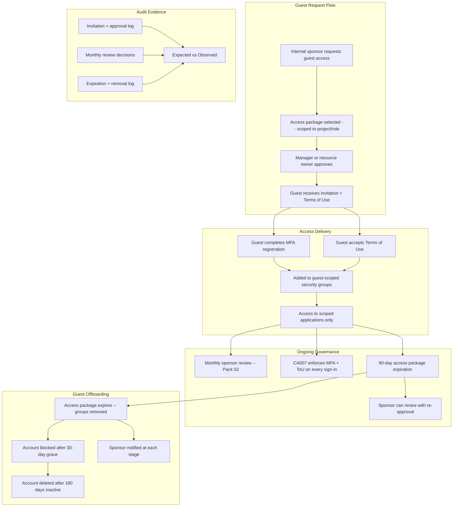

# Vendor / Guest vIAM Pack

> External identity lifecycle governance — from invitation to offboarding with automated expiration and sponsor accountability

[]()
[]()

---

> **Governance Notice** — This pack is governed by the [Stella Maris Constitution (CONST-01)](https://github.com/stella-maris-governance/smg-enterprise-hq) and enforces **POL-AC-01 (Access Control) · POL-SC-01 (Supply Chain) · NIST IA-8**. All dispositions are subject to the Two-Person Integrity Protocol.

---

## Start Here

| You Are | Read This First |
|---------|----------------|
| **Hiring Manager** | This README then [`expected-vs-observed.md`](docs/expected-vs-observed.md) — proves you can govern external access, not just invite and forget |
| **Consulting Client** | [`expected-vs-observed.md`](docs/expected-vs-observed.md) — if your guest accounts have no expiration, no sponsor, and no review, the gap is your engagement |
| **Auditor / GRC** | [`expected-vs-observed.md`](docs/expected-vs-observed.md) then [`control-mapping.md`](docs/control-mapping.md) — NIST IA-8, AC-2, PE-2 alignment |
| **Engineer** | [`/code/`](code/) for entitlement management configs then [`guest-lifecycle-runbook.md`](docs/guest-lifecycle-runbook.md) |

---

## The Problem

External identities are the front door you opened for partners and forgot to close.

When a consulting engagement starts, the vendor needs access. An Azure AD guest account is created, often by the project manager through a quick invitation. The vendor gets access to Teams channels, SharePoint sites, maybe an application or two. The engagement proceeds. Work gets done.

Six months later, the engagement ends. The consultant moves to another client. But their guest account is still active. Their access to your Teams channels, your SharePoint documents, your internal applications — all still live. Nobody revoked it because nobody owns guest lifecycle. The project manager who invited them moved on. IT doesn't know the guest exists. The vendor doesn't care — they still have access to a client environment, which is convenient if the relationship resumes.

In a regulated environment, an unmanaged external identity with access to internal resources is an access control failure. In a defense environment, it's a potential spillage event. The guest doesn't need malicious intent — they just need to accidentally access something they shouldn't, and the containment exercise begins.

This pack governs the entire guest lifecycle: structured invitation through access packages, automatic expiration dates, sponsor accountability, quarterly access reviews, and confirmed revocation at relationship end.

> **Watchstander Note:** In federal environments, every visitor requires a sponsor, a purpose, a badge, and an escort. When the visit ends, the badge is collected at the door. Guest identity governance is the digital equivalent — except the badge is an Entra ID account, the escort is an access package, and the door closes automatically on the expiration date.

---

## Overview

This pack delivers **full external identity lifecycle governance** using Entra ID Entitlement Management, cross-tenant access settings, and automated guest expiration. Every guest has a sponsor, an expiration date, and a recurring review. No permanent guests. No orphaned external accounts.

**The problem this solves:** Guest accounts are the most neglected identity type. Organizations invite contractors, partners, and vendors — then never review, never expire, and never offboard. Guest accounts become permanent backdoors with access to SharePoint, Teams, and sometimes more. This pack eliminates that entire risk class.

**Four pillars of guest governance:**

| Pillar | What It Does | How |
|--------|-------------|-----|
| **Invitation control** | Only authorized users can invite guests, through structured access packages | Entitlement Management access packages with approval |
| **Conditional access** | Guests must accept Terms of Use and complete MFA on every sign-in | CA007 from Pack 03 + cross-tenant access settings |
| **Automated expiration** | Guest access expires after defined period, auto-removed if not renewed | Access package assignment policy with 90-day max |
| **Sponsor accountability** | Every guest has an identified sponsor who reviews monthly | Monthly guest access review from Pack 02 + sponsor tracking |

**Business Value:** Guest governance is the #1 finding in external audit assessments. Organizations that can demonstrate invitation controls, automated expiration, and monthly sponsor review close this gap completely. This is also a CMMC requirement for any organization handling CUI with external partners.

**Operational Context:** Built from experience managing external credential issuance in military and federal environments where every guest CAC/PIV had a sponsor, an expiration, and a documented purpose — because untracked external credentials in classified environments is not a finding, it's an incident.

---

## Architecture


---

## Access Package Design

| Package Name | Target Audience | Includes | Max Duration | Approval | Auto-Renew |
|-------------|----------------|----------|-------------|----------|------------|
| Guest-Project-Collaboration | External project contributors | Teams channel, SharePoint site, relevant apps | 90 days | Sponsor + resource owner | Yes, with re-approval |
| Guest-Vendor-Support | Vendor support engineers | ServiceNow, scoped admin access | 90 days | IT manager | Yes, with re-approval |
| Guest-Audit-ReadOnly | External auditors | SharePoint (read-only), compliance reports | 30 days | GRC lead | No — single use |
| Guest-Executive-Sponsor | Executive-level partner access | Teams, email, SharePoint | 180 days | Executive sponsor | Yes, with re-approval |

### Assignment Policy Rules

- **Maximum duration:** 90 days (180 for executive sponsor)
- **Renewal:** Sponsor must re-request and re-approve before expiry
- **Non-renewal:** Access removed on expiry date, no grace period for access packages
- **Approval chain:** Minimum 1 approver (sponsor's manager or resource owner)
- **Justification required:** Every request and renewal must include business justification

---

## Cross-Tenant Access Settings

| Setting | Configuration | Purpose |
|---------|--------------|---------|
| Default inbound | Block all | No external access unless explicitly allowed |
| Trusted organizations | Add per-partner tenant | Named partners get streamlined access |
| B2B collaboration | Enabled for trusted orgs only | Guests from trusted tenants can be invited |
| B2B direct connect | Disabled (default) | No shared channels without explicit config |
| External user MFA trust | Trust MFA from trusted partners | Guests from trusted orgs skip MFA re-registration |
| Guest invite restrictions | Members + specific roles only | Not all users can invite guests |

---

## Guest Lifecycle Timeline
```
Day 0      Sponsor requests access package
Day 0-1    Approval granted, invitation sent
Day 1      Guest accepts ToU, registers MFA, accesses resources
Day 30     Monthly access review (Pack 02) — sponsor certifies
Day 60     Second monthly review
Day 83     Expiration warning sent to sponsor (7 days before)
Day 90     Access package expires — guest removed from groups
Day 90     Sponsor can renew (new 90-day cycle with re-approval)
Day 120    If not renewed — guest account blocked (30 days post-expiry)
Day 270    If still blocked — guest account deleted (180 days inactive)
```

---

## Compliance Mapping

| Framework | Control ID | Control Name | Implementation |
|-----------|-----------|--------------|----------------|
| NIST 800-53 | IA-8 | Identification and Auth (Non-Org Users) | MFA + ToU on every guest sign-in |
| NIST 800-53 | AC-2 | Account Management | Full guest lifecycle: invite, review, expire, delete |
| NIST 800-53 | AC-2(3) | Disable Accounts | Auto-block 30 days after expiry |
| NIST 800-53 | PE-2 | Physical Access Authorizations | Logical equivalent: sponsor authorization for external access |
| NIST 800-53 | PS-7 | External Personnel Security | Sponsor accountability, monthly review, access scoping |
| CIS Azure v2.0 | 1.1.6 | Restrict guest invite permissions | Only members + specific roles can invite |
| CMMC L2 | AC.L2-3.1.22 | Control Public Information | Guest access scoped, monitored, expired |
| CMMC L2 | AC.L2-3.1.3 | Control CUI Flow | Guests cannot access CUI without explicit access package |

> Full mapping: [`docs/control-mapping.md`](docs/control-mapping.md)

---

## What's Included

### `code/` — Deployable Artifacts

| File | Description |
|------|-------------|
| `access-package-project.json` | Entitlement Management: project collaboration package |
| `access-package-vendor.json` | Entitlement Management: vendor support package |
| `cross-tenant-settings.json` | Cross-tenant access baseline settings |
| `guest-expiration-scan.kql` | KQL: find guests past expiration with active access |
| `deploy-guest-governance.ps1` | PowerShell: deploy access packages + settings |

### `docs/` — SOPs, Runbooks, Evidence

| File | Description |
|------|-------------|
| [`expected-vs-observed.md`](docs/expected-vs-observed.md) | The Law of Evidence — 10 controls |
| [`guest-lifecycle-runbook.md`](docs/guest-lifecycle-runbook.md) | Full guest lifecycle SOP |
| [`control-mapping.md`](docs/control-mapping.md) | NIST / CIS / CMMC alignment |

### `screenshots/` — Evidence

This pack uses **deterministic engine outputs** as primary evidence rather than portal screenshots.

| Evidence Type | Format | Purpose |
|--------------|--------|---------|
| Engine output (`.txt`) | Script terminal output | Primary — proves logic and methodology |
| Report output (`.md`) | Formatted engine report | Primary — proves analysis and findings |
| Portal screenshot (`.png`) | Azure portal capture | Secondary — added when running against live environment |

> See `EVIDENCE-README.md` in the screenshots directory for the full evidence approach.

---

## Deployment Guide

| Step | Action | Duration |
|------|--------|----------|
| 1 | Configure cross-tenant access settings (block default inbound) | 30 min |
| 2 | Add trusted organizations (partner tenants) | 15 min per partner |
| 3 | Restrict guest invite permissions (Entra > External Identities) | 15 min |
| 4 | Create entitlement management catalog for external access | 30 min |
| 5 | Create access packages (project, vendor, audit, executive) | 1 hour |
| 6 | Configure assignment policies (approval, duration, renewal) | 30 min |
| 7 | Verify CA007 (Guest ToU + MFA) is active — Pack 03 | 15 min |
| 8 | Verify AR-GUEST-Monthly is active — Pack 02 | 15 min |
| 9 | Test: invite guest through access package, verify full flow | 1 hour |
| 10 | Capture screenshots and complete E-v-O | 1 hour |

---

## Related Packs

| Pack | Relationship |
|------|-------------|
| [Conditional Access Baseline](../03-conditional-access-baseline/) | CA007 enforces MFA + ToU on all guest sign-ins |
| [Access Reviews Automation](../02-access-reviews-automation/) | AR-GUEST-Monthly reviews all guest accounts |
| [Zero-Touch JML Lifecycle](../01-zero-touch-jml-lifecycle/) | Employee lifecycle is separate; this pack governs externals |
| [SoD Matrix](../05-sod-matrix/) | Guests excluded from admin roles by design |
| [Sentinel Detection](../../cloud-security-packs/02-sentinel-detection-runbook/) | Detects guest sign-in anomalies |

---

## Changelog

| Version | Date | Change |
|---------|------|--------|
| 1.0.0 | 2026-02-10 | Initial release |

---

<div align="center">

**© 2026 Stella Maris Governance LLC** — Evaluation and demonstration use permitted. Commercial use requires engagement.

*The work speaks for itself. Stella Maris — the one light that does not drift.*

</div>
