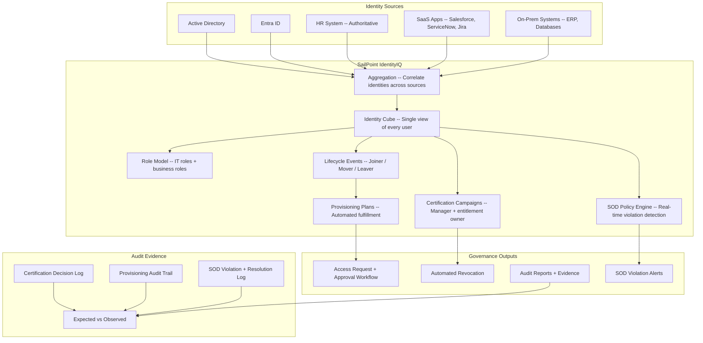

# SailPoint IdentityIQ Configuration Pack

> Enterprise identity governance — lifecycle automation, access certifications, role mining, and SOD enforcement at scale

---

> **Governance Notice** — This pack is governed by the [Stella Maris Constitution (CONST-01)](https://github.com/stella-maris-governance/smg-enterprise-hq) and enforces **POL-AC-01 (Access Control) · NIST AC-2, AC-6**. All dispositions are subject to the Two-Person Integrity Protocol.

---

## Start Here

| You Are | Read This First |
|---------|----------------|
| **Hiring Manager** | This README (architecture + config approach) then [`expected-vs-observed.md`](docs/expected-vs-observed.md) — proves enterprise IGA design and configuration, not just certification |
| **Consulting Client** | [`expected-vs-observed.md`](docs/expected-vs-observed.md) — if your IGA platform is deployed but not governed, the gap is your engagement |
| **Auditor / GRC** | [`expected-vs-observed.md`](docs/expected-vs-observed.md) then [`control-mapping.md`](docs/control-mapping.md) — NIST AC-2, AC-6, AU-2 alignment |
| **Engineer** | [`/code/`](code/) for IIQ config XML then [`iiq-operations-runbook.md`](docs/iiq-operations-runbook.md) |

---

## The Problem

Entra ID Lifecycle Workflows handle identity governance for organizations with hundreds of users and straightforward access patterns. But when the population grows to thousands, when access decisions depend on business logic that can't be expressed in dynamic group rules, when role mining reveals 400 unique access combinations that need to be rationalized into 30 enterprise roles, when certification campaigns span 10,000 entitlements across 200 applications — native cloud tooling hits its ceiling.

SailPoint IdentityIQ exists for this scale. It's not a replacement for Entra ID — it's the orchestration layer that sits above it. Where Entra ID manages authentication and basic lifecycle, SailPoint manages the complex identity governance decisions: who should have access to what, based on what role, approved by whom, reviewed on what cadence, with what risk score.

But SailPoint's power creates its own risk. A misconfigured certification campaign that auto-approves everything is worse than no campaign. A role model that's too broad grants excessive access to every user who matches. An aggregation task that fails silently means access decisions are being made on stale data. SailPoint must be governed as carefully as the identities it governs.

This pack configures SailPoint IIQ for enterprise identity governance: role modeling, lifecycle automation, access certifications, policy enforcement, and integration with Entra ID as the downstream identity provider.

> **Watchstander Note:** SailPoint is the enterprise-grade answer to identity governance at scale. But enterprise-grade tools require enterprise-grade discipline. The most common SailPoint failure isn't a misconfiguration — it's a certification campaign that runs on schedule, produces results, and gets approved without anyone actually reviewing the access. The tooling works. The governance question is whether anyone is watching.

---

## Overview

This pack demonstrates **enterprise-grade identity governance configuration** using SailPoint IdentityIQ — the platform that governs identity when Entra-native tools aren't enough.

**When you need SailPoint (and when you don't):**

| Scenario | Tool |
|----------|------|
| Single cloud tenant, under 500 users, Microsoft-only | Entra ID Governance (Packs 01-06) |
| Multi-source (AD + Entra + SaaS + on-prem), 500+ users, complex entitlements | **SailPoint IdentityIQ** |
| Regulated industry with SOX, SOD enforcement, role mining at scale | **SailPoint IdentityIQ** |
| Hybrid environment with legacy systems that don't support SCIM | **SailPoint IdentityIQ** |

**What this pack covers:**

| Capability | What It Does | IIQ Component |
|-----------|-------------|---------------|
| **Lifecycle management** | Joiner/mover/leaver across all connected sources | Lifecycle Events + Provisioning Policies |
| **Access certifications** | Manager and entitlement owner campaigns | Certification Campaigns |
| **Role management** | IT roles, business roles, entitlement bundles | Role Model + Role Mining |
| **SOD enforcement** | Policy violations detected and blocked in real time | SOD Policy + Violation Manager |
| **Provisioning** | Automated account create/modify/disable across systems | Provisioning Plans + Connectors |
| **Audit** | Every decision logged, exportable, framework-mapped | Audit Configuration + Reports |

**Business Value:** SailPoint is the enterprise answer to "who has access to what, and why." Organizations with complex environments — multiple directories, SaaS apps, on-prem systems, contractors, and regulatory requirements — need a platform that correlates identity across all sources. This pack delivers the configuration design, not just the install.

*Most SailPoint implementations fail not because the product is wrong, but because the governance design behind it is wrong. This pack is the governance design.*

---

## Architecture

---

## IIQ Configuration Summary

### Lifecycle Events

| Event | Trigger | Actions |
|-------|---------|---------|
| Joiner | Identity detected with no accounts, or hire date reached | Create AD account, create Entra account, assign birthright roles, send welcome notification |
| Mover | Department or manager change detected during aggregation | Recalculate roles, remove stale entitlements, add new entitlements, notify old + new manager |
| Leaver | Termination date reached or HR status = Inactive | Disable all accounts, remove all entitlements, archive identity, notify manager + IT |
| Rehire | Previously terminated identity reappears with active status | Reactivate accounts, reassign birthright roles, flag for manager review |

### Role Model

| Role Type | Purpose | Example |
|-----------|---------|---------|
| IT Role | Maps to a single system entitlement | AD-Engineering-ReadWrite, Salesforce-Standard-User |
| Business Role | Bundles multiple IT roles by job function | Engineer (includes AD group + Jira + GitHub access) |
| Birthright Role | Auto-assigned to all employees | Corporate-Baseline (email, intranet, HR self-service) |
| Organizational Role | Department-scoped access | Finance-Department (ERP read, budget reports, AP viewer) |

### Certification Campaigns

| Campaign | Scope | Reviewer | Frequency | Auto-Revoke |
|----------|-------|----------|-----------|-------------|
| Manager Access Review | All direct reports | People manager | Quarterly | Yes — 14 days |
| Entitlement Owner Review | High-risk entitlements | Entitlement owner | Quarterly | Yes — 14 days |
| SOD Violation Review | All open SOD violations | SOD policy owner | Monthly | Escalate to CISO |
| Privileged Access Review | Admin-level entitlements | Security team | Quarterly | Yes — 7 days |

### SOD Policies

| Policy | Left Role | Right Role | Risk | Action |
|--------|-----------|------------|------|--------|
| SOD-FIN-001 | AP Create Invoice | AP Approve Payment | Critical | Block + alert |
| SOD-FIN-002 | Vendor Master Create | AP Approve Payment | Critical | Block + alert |
| SOD-HR-001 | HR Data Entry | Payroll Approve | High | Alert + require exception |
| SOD-IT-001 | Change Requester | Change Approver | Medium | Alert |

> These mirror Pack 05 (SoD Matrix) Tier 3 conflicts — SailPoint enforces what the matrix defines.

---

## Compliance Mapping

| Framework | Control ID | Control Name | Implementation |
|-----------|-----------|--------------|----------------|
| NIST 800-53 | AC-2 | Account Management | Full lifecycle across all connected systems |
| NIST 800-53 | AC-2(4) | Automated Audit Actions | All provisioning and certification logged |
| NIST 800-53 | AC-5 | Separation of Duties | SOD policy engine with real-time detection |
| NIST 800-53 | AC-6 | Least Privilege | Role model ensures minimum necessary access |
| NIST 800-53 | AC-6(7) | Review of User Privileges | Quarterly certification campaigns |
| NIST 800-53 | AU-2 | Event Logging | Every identity event auditable |
| SOX ITGC | Periodic access review | Quarterly manager + entitlement owner certifications |
| SOX ITGC | Segregation of duties | Real-time SOD enforcement with blocking |
| CMMC L2 | AC.L2-3.1.1 | Authorized Access Control | Role-based access with certification |

> Full mapping: [`docs/control-mapping.md`](docs/control-mapping.md)

---

## What's Included

### `code/` — Configuration Artifacts

| File | Description |
|------|-------------|
| `lifecycle-events.xml` | IIQ lifecycle event triggers and provisioning actions |
| `role-model-sample.xml` | Sample role hierarchy: birthright, IT, business roles |
| `certification-campaigns.xml` | 4 certification campaign definitions |
| `sod-policies.xml` | SOD policy definitions with enforcement actions |
| `audit-configuration.xml` | Audit logging configuration |

### `docs/` — SOPs, Runbooks, Evidence

| File | Description |
|------|-------------|
| [`expected-vs-observed.md`](docs/expected-vs-observed.md) | The Law of Evidence — 10 controls |
| [`iiq-operations-runbook.md`](docs/iiq-operations-runbook.md) | Full IIQ operations SOP |
| [`control-mapping.md`](docs/control-mapping.md) | NIST / SOX / CMMC alignment |

### `screenshots/` — Evidence

This pack uses **deterministic engine outputs** as primary evidence rather than portal screenshots.

| Evidence Type | Format | Purpose |
|--------------|--------|---------|
| Engine output (`.txt`) | Script terminal output | Primary — proves logic and methodology |
| Report output (`.md`) | Formatted engine report | Primary — proves analysis and findings |
| Portal screenshot (`.png`) | Azure portal capture | Secondary — added when running against live environment |

> See `EVIDENCE-README.md` in the screenshots directory for the full evidence approach.

---

## Deployment Guide

| Step | Action | Duration |
|------|--------|----------|
| 1 | Connect authoritative source (HR system) | 2-4 hours |
| 2 | Connect target systems (AD, Entra, SaaS) | 2-8 hours per source |
| 3 | Run initial aggregation and correlation | 2 hours |
| 4 | Define role model (birthright → IT → business) | 1-2 days |
| 5 | Configure lifecycle events (joiner/mover/leaver) | 1 day |
| 6 | Configure certification campaigns | 4 hours |
| 7 | Configure SOD policies | 4 hours |
| 8 | Test full lifecycle: create user in HR → verify provisioning | 1 day |
| 9 | Run first certification campaign in pilot group | 2 weeks |
| 10 | Capture screenshots and complete E-v-O | 1 day |

> SailPoint IIQ is an enterprise platform. Deployment timelines are weeks to months depending on complexity. This pack provides the governance design; implementation requires SailPoint expertise and infrastructure.

---

## Related Packs

| Pack | Relationship |
|------|-------------|
| [Zero-Touch JML Lifecycle](../01-zero-touch-jml-lifecycle/) | Entra-native JML for simpler environments; SailPoint for enterprise |
| [Access Reviews Automation](../02-access-reviews-automation/) | Entra-native reviews; SailPoint certifications for multi-system |
| [SoD Matrix](../05-sod-matrix/) | SoD definitions; SailPoint enforces them at the platform level |
| [Vendor/Guest vIAM](../06-vendor-guest-viam/) | Entra governs guests; SailPoint can extend to external contractors |

---

## Changelog

| Version | Date | Change |
|---------|------|--------|
| 1.0.0 | 2026-02-10 | Initial release |

---

**© 2026 Stella Maris Governance LLC** — Evaluation and demonstration use permitted. Commercial use requires engagement.

*The work speaks for itself. Stella Maris — the one light that does not drift.*

