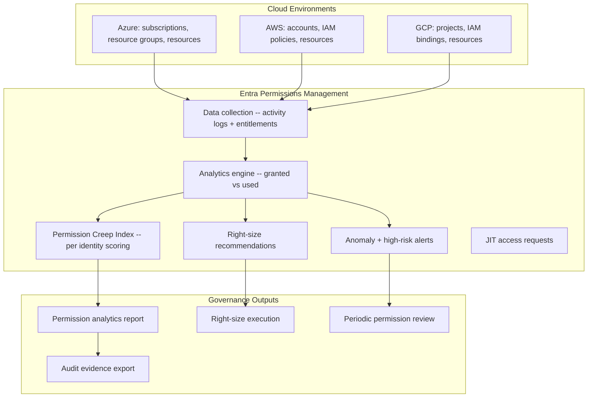

# Entra Permissions Management Pack

> Cloud Infrastructure Entitlement Management — discover, right-size, and monitor permissions across Azure, AWS, and GCP

---

## Start Here

| You Are | Read This First |
|---------|----------------|
| **Hiring Manager** | This README then [`expected-vs-observed.md`](docs/expected-vs-observed.md) — proves cloud permissions governance, not just discovery |
| **Consulting Client** | [`expected-vs-observed.md`](docs/expected-vs-observed.md) — if you don't know how many of your identities have permissions they've never used, the gap is your engagement |
| **Auditor / GRC** | [`expected-vs-observed.md`](docs/expected-vs-observed.md) then [`control-mapping.md`](docs/control-mapping.md) — NIST AC-6, AC-2(7) alignment |
| **Engineer** | [`/code/`](code/) for permission queries then [`ciem-operations-runbook.md`](docs/ciem-operations-runbook.md) |

---

## The Problem

Every cloud identity — user, service principal, managed identity, workload — accumulates permissions over time. A developer gets Contributor during a sprint and keeps it for two years. A service principal gets Owner because someone was troubleshooting at 0200 and never scoped it back. A managed identity has Key Vault access to secrets it hasn't read in six months.

This is the permissions gap: the distance between what an identity **can** do and what it **actually does.**

In a mature environment with 200 identities across Azure, you'll find that over 90% of granted permissions are never used. That's not a theoretical risk. That's blast radius waiting for a compromised credential.

Entra Permissions Management closes that gap.

---

## What This Pack Delivers

| Capability | What It Does | How |
|-----------|-------------|-----|
| **Discovery** | Inventory every identity and its effective permissions across cloud | Permissions Management multi-cloud onboarding |
| **Permission Creep Index** | Quantify the gap between granted and used permissions per identity | PCI scoring (0-100, lower is tighter) |
| **Right-sizing** | Recommend and apply least-privilege policies | Right-size recommendations + remediation |
| **Monitoring** | Detect permission anomalies and high-risk actions | Activity alerts + anomaly detection |
| **Just-in-time** | On-demand elevation instead of standing permissions | JIT access requests through Permissions Management |

---

## Architecture

---

## Permission Creep Index (PCI)

PCI is the core metric. It measures the gap between what an identity can do and what it has done.

| PCI Score | Meaning | Action |
|-----------|---------|--------|
| 0-33 | Tight — permissions closely match usage | Monitor |
| 34-67 | Moderate — significant unused permissions | Review and right-size |
| 68-100 | Critical — vast unused permissions, high blast radius | Immediate right-sizing |

**Target:** Organization-wide average PCI below 40. No identity above 80 without documented exception.

---

## Identity Types Governed

| Identity Type | Risk Profile | Common Findings |
|--------------|-------------|-----------------|
| **Users** | Medium | Standing Contributor/Owner from past projects |
| **Service Principals** | High | Over-scoped app registrations, often Owner-level |
| **Managed Identities** | Medium | Broad resource group access instead of resource-specific |
| **External Identities** | High | Guest accounts with inherited subscription access |
| **Cross-account roles** | Critical | AWS assume-role chains with excessive trust |

---

## Compliance Mapping

| Framework | Control ID | Control Name | Implementation |
|-----------|-----------|--------------|----------------|
| NIST 800-53 | AC-6 | Least Privilege | PCI scoring + right-size enforcement |
| NIST 800-53 | AC-6(1) | Authorize Access to Security Functions | High-risk permissions monitored |
| NIST 800-53 | AC-6(7) | Review of User Privileges | Periodic permission review |
| NIST 800-53 | AC-2(7) | Privileged User Accounts | Service principal + admin right-sizing |
| NIST 800-53 | AU-6 | Audit Record Review | Activity-based permission analytics |
| CIS Azure v2.0 | 1.1.1 | Ensure least privilege | PCI target + remediation |
| CMMC L2 | AC.L2-3.1.5 | Least Privilege | Quantified with PCI, enforced with right-sizing |
| CMMC L2 | AC.L2-3.1.7 | Privileged Functions | Admin and service principal permissions scoped |

> Full mapping: [`docs/control-mapping.md`](docs/control-mapping.md)

---

## What's Included

### `code/` — Queries and Automation

| File | Description |
|------|-------------|
| `high-pci-identities.kql` | KQL: identities with PCI above threshold |
| `service-principal-audit.kql` | KQL: service principals with unused high-privilege permissions |
| `rightsize-recommendations.json` | Sample right-size recommendation export format |
| `deploy-ciem-alerts.ps1` | PowerShell: configure permission anomaly alerts |

### `docs/` — SOPs, Runbooks, Evidence

| File | Description |
|------|-------------|
| [`expected-vs-observed.md`](docs/expected-vs-observed.md) | The Law of Evidence — 10 controls |
| [`ciem-operations-runbook.md`](docs/ciem-operations-runbook.md) | Full CIEM operations SOP |
| [`control-mapping.md`](docs/control-mapping.md) | NIST / CIS / CMMC alignment |

### `screenshots/` — Portal Evidence

| # | What It Shows |
|---|--------------|
| 01 | Permissions Management dashboard: PCI overview |
| 02 | High-PCI identity detail with granted vs used |
| 03 | Right-size recommendation for service principal |
| 04 | Activity alert: anomalous permission usage |
| 05 | Permission analytics trend: PCI over 90 days |

---

## Deployment Guide

| Step | Action | Duration |
|------|--------|----------|
| 1 | Enable Entra Permissions Management (requires Entra Suite or standalone license) | 15 min |
| 2 | Onboard Azure subscriptions (data collector configuration) | 1 hour |
| 3 | Onboard AWS accounts (CloudTrail + cross-account role) | 2 hours per account |
| 4 | Onboard GCP projects (activity log export) | 2 hours per project |
| 5 | Wait for initial data collection (minimum 7 days for baseline) | 7 days |
| 6 | Review PCI scores and triage high-risk identities | 2 hours |
| 7 | Apply right-size recommendations (start with service principals) | 4 hours |
| 8 | Configure anomaly alerts | 1 hour |
| 9 | Establish periodic review cadence | 30 min |
| 10 | Capture screenshots and complete E-v-O | 1 hour |

> **Watchstander Note:** PCI scores are a trailing indicator. No governance decisions shall be finalized until a 14-day baseline is established. Integrity requires patience.

---

## Related Packs

| Pack | Relationship |
|------|-------------|
| [PIM + Break-Glass SOP](../04-pim-breakglass-sop/) | PIM governs admin role activation; CIEM governs resource-level permissions |
| [Conditional Access Baseline](../03-conditional-access-baseline/) | CA controls sign-in; CIEM controls what happens after sign-in |
| [Access Reviews Automation](../02-access-reviews-automation/) | Access reviews certify role membership; CIEM validates actual permission usage |
| [SoD Matrix](../05-sod-matrix/) | SoD prevents toxic role combinations; CIEM detects over-scoped individual permissions |

---

## Changelog

| Version | Date | Change |
|---------|------|--------|
| 1.0.0 | 2026-02-10 | Initial release |

---

**© 2026 Stella Maris Governance LLC**

*The work speaks for itself. Stella Maris — the one light that does not drift.*

