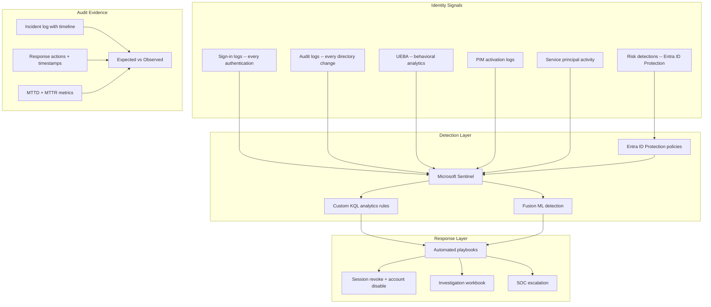

# Identity Threat Detection & Response Pack

> Detect, investigate, and respond to identity-based attacks — compromised credentials, lateral movement, and privilege escalation before the blast radius expands

---

## Start Here

| You Are | Read This First |
|---------|----------------|
| **Hiring Manager** | This README then [`expected-vs-observed.md`](docs/expected-vs-observed.md) — proves identity threat detection is operational, not theoretical |
| **Consulting Client** | [`expected-vs-observed.md`](docs/expected-vs-observed.md) — if you can't detect a compromised identity within 30 minutes, the gap is your engagement |
| **Auditor / GRC** | [`expected-vs-observed.md`](docs/expected-vs-observed.md) then [`control-mapping.md`](docs/control-mapping.md) — NIST SI-4, IR-4, IR-5 alignment |
| **Engineer** | [`/code/`](code/) for detection KQL then [`itdr-operations-runbook.md`](docs/itdr-operations-runbook.md) |

---

## The Problem

Every major breach in the last five years started with an identity. Not a firewall bypass. Not a zero-day. An identity.

A phished credential. A stolen session token. A compromised service principal. A dormant account reactivated by an attacker. By the time the SOC sees lateral movement or data exfiltration, the identity was compromised hours or days ago.

ITDR closes that gap. It moves detection from the network layer — where you're already too late — to the identity layer, where the first signal appears.

**The identity is always the first domino.** If you detect it falling, you stop the chain.

---

## What This Pack Delivers

| Capability | What It Detects | How |
|-----------|----------------|-----|
| **Compromised credential detection** | Password spray, brute force, token theft, AiTM phishing | Entra ID Protection risk signals + custom KQL |
| **Impossible travel** | Sign-ins from geographically impossible locations | Entra ID Protection + Sentinel analytics |
| **Privilege escalation** | Unauthorized PIM activation, role assignment outside process | Sentinel KQL + PIM audit correlation |
| **Lateral movement** | Compromised identity accessing resources outside normal pattern | Sentinel UEBA + custom analytics |
| **Dormant account reactivation** | Inactive account suddenly active | Custom KQL: last sign-in > 90 days then activity |
| **Service principal compromise** | SP credential theft, anomalous SP behavior | Custom KQL + Permissions Management alerts |

---

## Architecture

---

## Detection Rule Library

### Tier 1 — Automated Response (High Confidence)

These detections trigger automated remediation. No human in the loop for initial containment.

| Rule | Signal | Auto-Response | SLA |
|------|--------|---------------|-----|
| ITDR-001: Confirmed compromised account | Entra ID Protection: High risk user | Disable account, revoke sessions, notify SOC | Immediate |
| ITDR-002: Impossible travel + MFA anomaly | Two sign-ins > 500 miles apart within 1 hour AND new MFA method | Block sign-in, revoke sessions, require admin re-enable | Immediate |
| ITDR-003: Password spray detected | > 10 failed sign-ins from single IP across multiple accounts | Block IP, flag all targeted accounts, alert SOC | < 5 min |

### Tier 2 — Alert + Investigate (Medium Confidence)

These detections alert the SOC for human investigation. Automated containment available but not default.

| Rule | Signal | Response | SLA |
|------|--------|----------|-----|
| ITDR-004: Privilege escalation outside PIM | Global Admin or Security Admin assigned via direct assignment (not PIM) | Alert SOC, check if assignment was authorized | < 30 min |
| ITDR-005: Dormant account reactivation | Account with no sign-in > 90 days suddenly authenticates | Alert SOC, correlate with HR status | < 30 min |
| ITDR-006: Service principal anomaly | SP uses permission category for first time OR activity 3x baseline | Alert IAM Lead, correlate with change requests | < 1 hour |

### Tier 3 — Hunt + Baseline (Low Signal)

These are hunting queries run proactively. Not real-time alerts.

| Rule | Signal | Cadence |
|------|--------|---------|
| ITDR-007: Stale credential usage | Authentication with credentials issued > 365 days ago | Weekly |
| ITDR-008: Token replay indicators | Same token used from different IPs within short window | Weekly |
| ITDR-009: Consent grant anomaly | User consented to high-permission OAuth app | Weekly |
| ITDR-010: Cross-tenant lateral movement | Guest account from trusted tenant shows anomalous behavior | Weekly |

---

## Response Metrics

| Metric | Target | Definition |
|--------|--------|------------|
| **MTTD** (Mean Time to Detect) | < 15 minutes | Time from first malicious signal to detection alert |
| **MTTR** (Mean Time to Respond) | < 30 minutes | Time from detection alert to containment action |
| **Tier 1 auto-response** | < 2 minutes | Automated containment for high-confidence detections |
| **False positive rate** | < 20% | Percentage of alerts that are benign after investigation |

> **Watchstander Note:** MTTD and MTTR are only meaningful with timestamps. Every incident must have: first signal timestamp, alert timestamp, acknowledgment timestamp, containment timestamp. Without the chain, the metric is fiction.

---

## Compliance Mapping

| Framework | Control ID | Control Name | Implementation |
|-----------|-----------|--------------|----------------|
| NIST 800-53 | SI-4 | System Monitoring | Continuous identity signal monitoring via Sentinel |
| NIST 800-53 | SI-4(5) | System-Generated Alerts | Automated alerts on identity anomalies |
| NIST 800-53 | IR-4 | Incident Handling | Tiered response: auto-contain, investigate, escalate |
| NIST 800-53 | IR-5 | Incident Monitoring | MTTD/MTTR tracking, incident log |
| NIST 800-53 | IR-6 | Incident Reporting | SOC notification chain with timestamps |
| NIST 800-53 | AC-7 | Unsuccessful Logon Attempts | Password spray detection + IP blocking |
| CIS Azure v2.0 | 1.1.3 | Ensure risky sign-in policies | Entra ID Protection: block high risk |
| CMMC L2 | IR.L2-3.6.1 | Incident Handling | Documented response procedures with SLAs |
| CMMC L2 | SI.L2-3.14.6 | Monitor Communications | Identity signal monitoring |

> Full mapping: [`docs/control-mapping.md`](docs/control-mapping.md)

---

## What's Included

### `code/` — Detection Rules and Playbooks

| File | Description |
|------|-------------|
| `itdr-001-compromised-account.kql` | Sentinel: confirmed compromised auto-response trigger |
| `itdr-004-privilege-escalation.kql` | Sentinel: role assignment outside PIM workflow |
| `itdr-005-dormant-reactivation.kql` | Sentinel: dormant account reactivation detection |
| `itdr-006-sp-anomaly.kql` | Sentinel: service principal behavioral anomaly |
| `itdr-weekly-hunt.kql` | Combined weekly hunting query (Tier 3 rules) |
| `playbook-revoke-contain.json` | Logic App: auto-revoke sessions + disable account |
| `deploy-itdr-rules.ps1` | PowerShell: deploy all Sentinel analytics rules |

### `docs/` — SOPs, Runbooks, Evidence

| File | Description |
|------|-------------|
| [`expected-vs-observed.md`](docs/expected-vs-observed.md) | The Law of Evidence — 10 controls |
| [`itdr-operations-runbook.md`](docs/itdr-operations-runbook.md) | Full ITDR operations SOP |
| [`control-mapping.md`](docs/control-mapping.md) | NIST / CIS / CMMC alignment |

### `screenshots/` — Portal Evidence

| # | What It Shows |
|---|--------------|
| 01 | Sentinel analytics rules: ITDR rules active |
| 02 | Entra ID Protection: risk policy configuration |
| 03 | Incident timeline: detection → containment |
| 04 | Playbook execution: auto-revoke evidence |
| 05 | MTTD/MTTR dashboard |

---

## Deployment Guide

| Step | Action | Duration |
|------|--------|----------|
| 1 | Verify Sentinel workspace connected to Entra sign-in + audit logs | 30 min |
| 2 | Enable Entra ID Protection risk policies (user risk + sign-in risk) | 30 min |
| 3 | Enable UEBA in Sentinel | 15 min |
| 4 | Deploy Tier 1 analytics rules (auto-response) | 1 hour |
| 5 | Deploy Tier 2 analytics rules (alert + investigate) | 1 hour |
| 6 | Deploy auto-containment playbook (Logic App) | 1 hour |
| 7 | Configure Tier 3 hunting queries as saved searches | 30 min |
| 8 | Run tabletop exercise: simulate compromised credential | 2 hours |
| 9 | Validate MTTD/MTTR from tabletop | 1 hour |
| 10 | Capture screenshots and complete E-v-O | 1 hour |

> **Watchstander Note:** A detection rule that has never fired is an untested control. The tabletop exercise in Step 8 is not optional. Every Tier 1 and Tier 2 rule must be validated against a controlled simulation before it is trusted in production. Untested rules create false confidence.

---

## Related Packs

| Pack | Relationship |
|------|-------------|
| [PIM + Break-Glass SOP](../04-pim-breakglass-sop/) | ITDR-004 detects privilege assignment outside PIM |
| [Conditional Access Baseline](../03-conditional-access-baseline/) | CA enforces MFA; ITDR detects when MFA is bypassed |
| [Entra Permissions Management](../08-entra-permissions-management/) | CIEM detects permission creep; ITDR detects compromised use |
| [Vendor/Guest vIAM](../06-vendor-guest-viam/) | ITDR-010 detects cross-tenant lateral movement via guests |
| [Access Reviews Automation](../02-access-reviews-automation/) | Reviews reduce attack surface; ITDR monitors what's left |
| [Sentinel Detection](../../cloud-security-packs/02-sentinel-detection-runbook/) | ITDR rules deploy into the same Sentinel workspace |

---

## Changelog

| Version | Date | Change |
|---------|------|--------|
| 1.0.0 | 2026-02-10 | Initial release |

---

**© 2026 Stella Maris Governance LLC**

*The work speaks for itself. Stella Maris — the one light that does not drift.*

